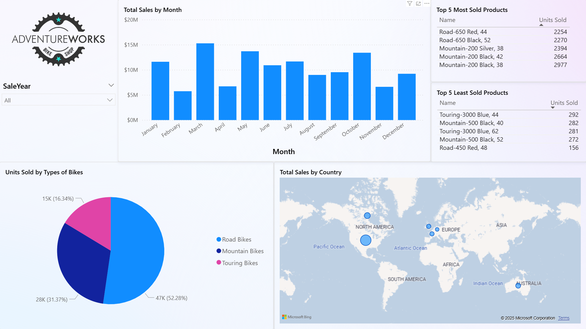

I’ve been working with Tableau for a while, but recently I decided it was time to dive into Power BI. To get some hands-on practice, I chose a sample sales dataset and set out to build a dashboard that could highlight trends in products, territories, and revenue. What started as an experiment quickly turned into a fun project with some solid insights.

# The Dataset

For this project, I used the AdventureWorks sample sales database. It contains information about products, territories, subcategories, and sales over time.

Before building the visuals, I had to do a little data prep:

* Converted month numbers into month names (so January, February, etc. instead of 1, 2, 3).

* Changed fields like sales amount into a proper currency format.

* Made sure territories like Southwest, Central, Northeast were mapped correctly.

This step made the visuals more intuitive and ready for analysis.

# Building the Dashboard

I started by creating a few queries in Power BI’s Power Query Editor:

* Most sold product → which bike had the highest sales volume.

* Least sold product → which product underperformed.

* Subcategory breakdown → total units sold by bike type (mountain, road, touring, etc.).

* Sales by territory → performance across regions like the United States, Canada, UK, France, and more.

From there, I built out the visuals:

* A bar chart showing monthly sales trends.

* Card visuals highlighting the best and worst sellers.

* A pie chart to illustrate the sales split by bike subcategory.

* A map visual to show sales by territory.

Along the way, I learned how to:

* Sort months properly using “Sort by Column.”

* Add filters (slicers) so I could view results by year.

* Clean up the design by removing chart backgrounds and adding a company logo.

# Key Insights

A few interesting things stood out:

* Some bike subcategories were clear winners, dominating total units sold.

* The U.S. territories (Central, Southwest, Northeast, etc.) made up the bulk of sales, but there was meaningful activity in Canada and Europe as well.

* The monthly breakdown showed predictable peaks and dips, which could be useful for future forecasting.

# Design Choices

I wanted the dashboard to feel clean and modern, so I:

* Removed unnecessary borders and backgrounds.

* Used cards for quick KPIs (best seller, worst seller).

* Placed the logo in the corner to give it a branded look.

* Arranged visuals logically: trends on the left, categories and maps on the right.

# What I Learned

This project helped me:

* Get comfortable with Power BI’s query editor.

* Practice using filters and slicers to add interactivity.

* Think about dashboard design in terms of both analysis and presentation.

Compared to Tableau, Power BI felt more integrated with Microsoft tools and had a smoother workflow for data prep. Tableau still feels stronger for quick visual design, but Power BI shines when it comes to reporting and sharing in a business environment.

# Next Steps

If I were to expand this project, I’d like to:

* Add more KPIs (like revenue by customer segment).

* Build a forecasting model to predict future sales.

* Try embedding the interactive dashboard into my website instead of just sharing images.

# Conclusion

This was my first end-to-end project in Power BI, and I’m really happy with how it turned out. It’s one thing to follow tutorials, but working with an actual dataset and creating visuals from scratch is the best way to learn.

If you’re just starting with Power BI, I highly recommend picking a dataset that interests you and giving it a try!



SQL code used:

```
SELECT TOP 1 People.FirstName, People.LastName, SalesTeam.SalesYTD
FROM Sales.SalesPerson SalesTeam
JOIN Person.Person People
ON People.BusinessEntityID = SalesTeam.BusinessEntityID
ORDER BY SalesTeam.SalesYTD DESC

SELECT Year(OrderDate) SaleYear, MONTH(OrderDate) SaleMonth, SUM(TotalDue) TotalSales
FROM Sales.SalesOrderHeader Header
GROUP BY Year(OrderDate), MONTH(OrderDate)

SELECT ProductTable.Name ProductName, OrderTable.ProductID, SUM(OrderQty) TotalUnitsSold
FROM Sales.SalesOrderDetail OrderTable
JOIN Production.Product ProductTable
ON ProductTable.ProductID = OrderTable.ProductID
JOIN Production.ProductSubcategory ProductSubCategory
ON ProductTable.ProductSubcategoryID = ProductSubCategory.ProductSubcategoryID
JOIN Production.ProductCategory ProductCategory
ON ProductSubCategory.ProductCategoryID = ProductCategory.ProductCategoryID
WHERE ProductCategory.Name = 'Bikes'
GROUP BY OrderTable.ProductID, ProductTable.Name
ORDER BY TotalUnitsSold DESC


SELECT ProductSubcategory.Name SubCategoryName, SUM(OrderQty) TotalUnitsSold
FROM Sales.SalesOrderDetail OrderTable
JOIN Production.Product ProductTable
ON ProductTable.ProductID = OrderTable.ProductID
JOIN Production.ProductSubcategory ProductSubCategory
ON ProductTable.ProductSubcategoryID = ProductSubCategory.ProductSubcategoryID
WHERE ProductSubcategory.Name LIKE '%bike%'
AND ProductSubcategory.Name NOT LIKE '%bike rack%'
AND ProductSubcategory.Name NOT LIKE '%bike stand%'
GROUP BY ProductSubcategory.Name
ORDER BY TotalUnitsSold DESC

SELECT st.Name AS TerritoryName, st.CountryRegionCode, SUM(soh.TotalDue) AS TotalSales
FROM Sales.SalesOrderHeader soh
JOIN Sales.SalesTerritory st
ON soh.TerritoryID = st.TerritoryID
GROUP BY st.Name, st.CountryRegionCode
ORDER BY TotalSales DESC
```
