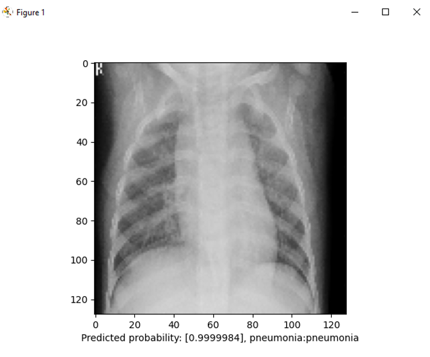

In this project, the concept of artificial neural networks will be reviewed and applied to a binary image classification problem. First, an in-depth description of neural networks is done, fundamentally defining the key components of their structure and the mathematical concepts used to construct them. The concepts involving activation functions, gradient descent, and backpropagation will also be touched upon. In addition, customizable variables will be introduced to deter overfitting and enable user-led optimization practices. This information would then be used to define convolutional neural networks and what enables them to be effective at feature detection. Finally, a binary image classification example using Python and the Keras library is showcased to show the effectiveness of neural networks in solving real-world problems. This example implements image pattern recognition to classify whether a patient has pneumonia based on X-Ray images.

Software used: Python, Keras, Kaggle, TensorFlow, matplotlib

[Neural Networks Research Paper](https://arnoldant.github.io/website/posts/pp7/NN-IC-AA.pdf)

